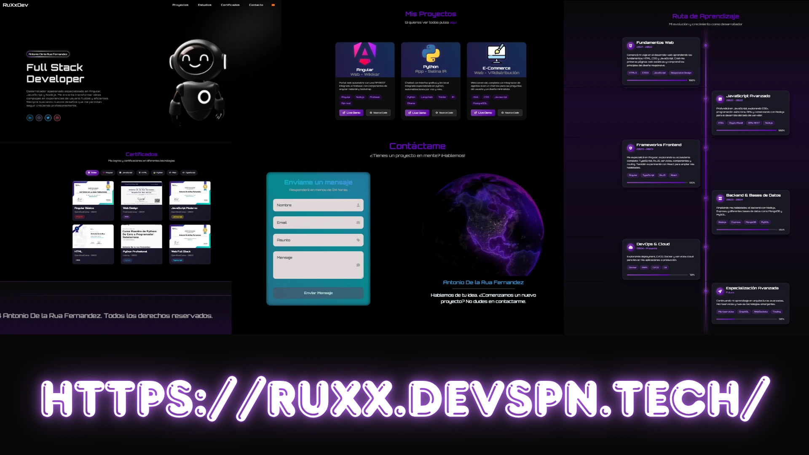

# Portfolio - Desarrollador Frontend



## 🚀 Sobre el Proyecto

Este es el portfolio personal de un desarrollador frontend, construido con Angular. El sitio web es completamente responsivo y está optimizado para dispositivos móviles y tablets, ofreciendo una experiencia de usuario fluida en todas las plataformas.

El portfolio incluye secciones para mostrar proyectos, certificados, habilidades técnicas, y un formulario de contacto. Además, cuenta con funcionalidades interactivas como un reproductor de audio y optimización de imágenes.

## ✨ Características

- **Diseño Responsivo**: Adaptable a móviles, tablets y escritorio.
- **Internacionalización (i18n)**: Soporte para múltiples idiomas (español e inglés).
- **Componentes Interactivos**: Incluye un reproductor de audio, imágenes interactivas y formularios dinámicos.
- **Optimización de Imágenes**: Servicio integrado para mejorar el rendimiento de las imágenes.
- **Secciones Principales**:
  - Hero: Presentación inicial.
  - Proyectos: Galería de trabajos realizados.
  - Certificados: Credenciales y logros.
  - Contacto: Formulario para comunicación.
  - Ruta de Aprendizaje: Sección educativa.

## 🛠 Tecnologías Utilizadas

- **Framework**: Angular
- **Lenguajes**: TypeScript, HTML, CSS, SCSS
- **Herramientas**:
  - Angular CLI
  - Service Worker (PWA)
  - Optimización de Imágenes
- **Dependencias**: Ver `package.json` para la lista completa.

## 📦 Instalación

Sigue estos pasos para instalar y ejecutar el proyecto localmente:

1. **Clona el repositorio**:
   ```bash
   git clone https://github.com/tu-usuario/RuXx-site-action.git
   cd RuXx-site-action
   ```

2. **Instala las dependencias**:
   ```bash
   npm install
   ```

3. **Ejecuta el servidor de desarrollo**:
   ```bash
   ng serve
   ```

4. **Abre tu navegador** y ve a `http://localhost:4200`.

## 🚀 Uso

Una vez instalado, puedes:

- Navegar por las diferentes secciones del portfolio.
- Cambiar el idioma usando los controles de internacionalización.
- Interactuar con el reproductor de audio y las imágenes.
- Enviar mensajes a través del formulario de contacto.

Para construir la aplicación para producción:
```bash
ng build --prod
```

Los archivos generados estarán en la carpeta `dist/`.

## 📖 Ejemplos

### Agregar un Nuevo Proyecto

Para agregar un nuevo proyecto a la sección de proyectos, edita el archivo `src/app/components/proyectos/proyectos.ts` y añade un nuevo objeto al array de proyectos.

### Personalizar el Tema

Modifica los estilos en `src/styles.css` o en los archivos CSS de componentes individuales para cambiar colores, fuentes, etc.

## 🤝 Contribuciones

¡Las contribuciones son bienvenidas! Si deseas mejorar este proyecto:

1. Haz un fork del repositorio.
2. Crea una rama para tu feature (`git checkout -b feature/nueva-funcionalidad`).
3. Realiza tus cambios y haz commit (`git commit -am 'Agrega nueva funcionalidad'`).
4. Push a la rama (`git push origin feature/nueva-funcionalidad`).
5. Abre un Pull Request.

Por favor, asegúrate de que tu código siga las mejores prácticas de Angular y esté bien documentado.

## 📄 Licencia

Este proyecto está bajo la Licencia MIT. Consulta el archivo `LICENSE` para más detalles.

## 📧 Contacto

Si tienes preguntas o sugerencias, puedes contactarme a través de:

- Email: tu-email@example.com
- LinkedIn: [Tu Perfil](https://linkedin.com/in/tu-perfil)
- Sitio Web: [Tu Portfolio](https://tu-portfolio.com)

---

¡Gracias por visitar mi portfolio! Espero que te inspire en tus propios proyectos.
